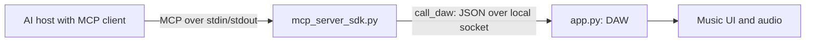

# Introduction to MCP servers: theory, application and production

By the end of one hour, a beginner should explain MCP, choose where to apply it,
identify host/client/server/backend responsibilities, and defend a narrow tool
design. One short AI-assisted exercise makes the boundary concrete. All full
implementations are appendix references; memorizing Python is not the objective.

Use the [theory-focused PowerPoint](workshop_delivery/MCPJAM-Intro-Theory-and-Production.pptx)
and [slide-by-slide instructor guide](workshop_delivery/Instructor-Guide.md).
For interview practice, use [INTERVIEW_PREP.md](INTERVIEW_PREP.md): 20 questions,
answer outlines, scenarios, follow-ups and a production gap checklist.
Windows and Mac use the same code and exercises.

## Prepare both platforms before class

Distribute the [student code pack](workshop_delivery/MCPJAM-Student-Code.zip),
[quick start](workshop_delivery/Student-Quick-Start.md) and
[Mac setup guide](MAC_SETUP.md). Keep the package folder named MCPJAM.
Students install dependencies and rehearse host configuration before the hour.

For a new Mac installation, use standard Python 3.13 from python.org with Tk.
Follow [MAC_SETUP.md](MAC_SETUP.md) for installer, certificates and troubleshooting.
The same exercise code is used on Intel and Apple Silicon. Each computer creates its
own virtual environment; do not distribute .venv or copy it between platforms.

| Task | Windows / PowerShell | macOS / Terminal |
| --- | --- | --- |
| Create environment, inside MCPJAM | `python -m venv .venv` | `python3.13 -m venv .venv` |
| Workshop interpreter | `.\.venv\Scripts\python.exe` | `./.venv/bin/python` |
| Install | `.\.venv\Scripts\python.exe -m pip install -r requirements.txt` | `./.venv/bin/python -m pip install -r requirements.txt` |
| Check imports and SDK | `.\.venv\Scripts\python.exe workshop_preflight.py` | `./.venv/bin/python workshop_preflight.py` |
| Check Tk window | `.\.venv\Scripts\python.exe -m tkinter` | `./.venv/bin/python -m tkinter` |
| Start DAW, from package parent | `.\MCPJAM\.venv\Scripts\python.exe -m MCPJAM` | `./MCPJAM/.venv/bin/python -m MCPJAM` |

No activation is required. The DAW is a package: launch it from its parent
with -m MCPJAM instead of running app.py directly. Keep that terminal open.
MIDI hardware, FluidSynth and an external soundfont are optional. If audio fails,
use the UI and state results to assess tools.

## Host connection on either platform

From inside MCPJAM, print example JSON with the actual interpreter/server paths:

```bash
# macOS
./.venv/bin/python workshop_preflight.py --host-config
```

```powershell
# Windows
.\.venv\Scripts\python.exe workshop_preflight.py --host-config
```

Copy the paths into the chosen host's configuration. The mcpServers structure
is a host-specific example, not an MCP standard. Use absolute paths, keep any
spaces inside one JSON string, and avoid ~. Reconnect/restart after edits.
The host launches its stdio subprocess; no second manually launched server is
needed. [README.md](README.md) contains Windows and Mac JSON examples.

## One-hour teaching route

| Time | Explain, apply, defend |
| --- | --- |
| 00-13 | Live example; definitions; architecture; primitives; MCP versus function calling, APIs and RAG. |
| 13-25 | Application choices; protocol-revision differences; transports; tool contract and thin adapter. |
| 25-31 | Accepted versus completed; one three-line Python excerpt; SDK versus developer responsibilities. |
| 31-38 | Seven-minute AI-assisted practice: define, add and test set_swing. |
| 38-40 | Explain protocol/tool/backend errors and verification evidence. |
| 40-55 | Identity, permissions, injection, tokens, SSRF, retries and production deployment; six memorable patterns. |
| 55-60 | Design scenario and a 90-second interview answer. |

There are 21 timed slides and 13 reference slides. Setup is completed before
class. The main deck has only one three-line Python excerpt. Full functions,
platform commands, host JSON and optional mute implementation are in the appendix.
The focus is theory and design reasoning, with one small exercise to test understanding.

## Six memorable production patterns

Label these explicitly when teaching. They are common engineering practices,
not a claim that the local demo implements a production deployment.

1. **Thin adapter, narrow contract:** reuse backend behavior and expose a clear operation.
2. **Truthful outcomes:** accepted/queued is not completed; verify the effect.
3. **Least privilege:** authenticate caller and authorize action/object; separate host approval.
4. **Trust boundaries:** untrusted content must not gain new authority; review updates.
5. **Reliable operations:** bound work, retry by side effect and make outcomes observable.
6. **Defense at each hop:** gateway controls supplement server/backend authorization.

Ask students to relate each pattern to a real application and identify the demo gap.
The music server demonstrates typed tools, domain validation, adapter mapping,
queued outcomes, state readback, a 5-second timeout and a 1 MiB reply bound.
It does not implement OAuth, per-user/tenant access, rate limiting, idempotency,
durable jobs, production audit or injection-proof model reasoning.

## Interview coverage and revision awareness

Practise definitions and comparisons, architecture, when MCP helps, primitive
choice, transport trade-offs, capability support, tool schemas/results, error
layers, authentication/authorization/consent, injection and proxy threats,
retries/idempotency, observability and a customer-support design scenario.
Use INTERVIEW_PREP.md for role-appropriate follow-ups rather than promising a
particular interview outcome.

The exercise stays on validated Python SDK 1.19.0. Its older handshake is not
universal current MCP behavior. The July 2026 revision removes initialize/
initialized and protocol session IDs, carries metadata per request, and adds
optional server/discover plus new interaction mechanics. The main slides explain
this distinction. Deployment/interview wire details must name the supported
revision. See the [official revision notes](https://blog.modelcontextprotocol.io/posts/2026-07-28/).

## Keep the code boundary clear



mcp_server_sdk.py uses FastMCP from the official SDK, pinned to 1.19.0. The
starter registers get_state and set_tempo only. Students add or review set_swing; mute_track
is an optional follow-up. The completed reference is mcp_server_solution.py in the pack.

app.py already implements the swing/mute commands. Port 8765 is an unauthenticated
loopback demo socket, not MCP. Writes are acknowledged when queued; read state
after the UI processes them. The SDK handles lifecycle, schemas, dispatch and
transport. Validation and permissions remain application responsibilities.
The older mcp_server.py is not the class server.

## Explicit tests

On Mac, inside MCPJAM with the DAW running and the student tool added:

```bash
./.venv/bin/python workshop_client.py --tool set_swing --arguments '{"amount":35}'
./.venv/bin/python workshop_client.py --tool get_state
./.venv/bin/python workshop_client.py --tool set_swing --arguments '{"amount":100}'
```

On Windows, an input file avoids PowerShell's native JSON quoting differences:

```powershell
Set-Content -LiteralPath swing-input.json -Value '{"amount":35}' -Encoding UTF8
.\.venv\Scripts\python.exe workshop_client.py --tool set_swing --arguments-file swing-input.json
.\.venv\Scripts\python.exe workshop_client.py --tool get_state
```

Repeat with 0 and 75 (accepted), then 100 (tool error, client exit code 1).
Natural-language refusal does not prove server validation. Inspect the actual
call/result and returned swing key. For mute, test kick with true/false and
reject violin; verify the kick entry in the returned muted dictionary.

## Instructor verification

Rehearse setup on Windows and a participant Mac before class. Preflight checks
imports and SDK version, not GUI/audio or host behavior. Show 120 BPM, then valid
and invalid swing calls on each platform. Windows protocol tests and PowerPoint
rendering checks do not establish native macOS runtime results.

Recovery: tools missing → check paths and reconnect; connection refused → start
the DAW; no Tk → follow the Mac setup guide; state unchanged → check command
spelling and allow the queue to apply. Send server debug logs to stderr.

Finish by asking students to identify the server file, explain @mcp.tool(),
locate the backend call, distinguish the two transports, and show where validation
prevents an invalid action. OAuth, gateways, sampling and elicitation are
extensions, not implemented demo capabilities.
