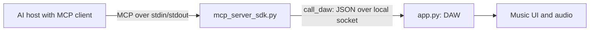

# MCPJAM workshop: Windows and macOS

By the end of one hour, each student will implement and test a new tool in a
real MCP server. They should identify the host/client, server, transport, tool
and backend, explain what the SDK handles, and name one security boundary.
Basic Python functions and dictionaries are assumed; prior MCP experience is not.

Use the [slide-by-slide instructor guide](workshop_delivery/Instructor-Guide.md)
and [Windows + Mac PowerPoint](workshop_delivery/MCPJAM-Workshop-Windows-and-Mac.pptx).
The guide includes speaker notes and the advanced/security discussion.

## Prepare both platforms before class

Distribute the [student code pack](workshop_delivery/MCPJAM-Student-Code.zip),
[quick start](workshop_delivery/Student-Quick-Start.md) and
[Mac setup guide](MAC_SETUP.md). Keep the package folder named MCPJAM.
Students install dependencies and rehearse host configuration before the hour.

For a new Mac installation, use standard Python 3.13 from python.org with Tk.
Follow [MAC_SETUP.md](MAC_SETUP.md) for installer, certificates and troubleshooting.
The same exercises work on Intel and Apple Silicon. Each computer creates its
own virtual environment; do not distribute .venv or copy it between platforms.

| Task | Windows / PowerShell | macOS / Terminal |
| --- | --- | --- |
| Create environment, inside MCPJAM | `python -m venv .venv` | `python3.13 -m venv .venv` |
| Workshop interpreter | `.\.venv\Scripts\python.exe` | `./.venv/bin/python` |
| Install | `.\.venv\Scripts\python.exe -m pip install -r requirements.txt` | `./.venv/bin/python -m pip install -r requirements.txt` |
| Check imports and SDK | `.\.venv\Scripts\python.exe workshop_preflight.py` | `./.venv/bin/python workshop_preflight.py` |
| Check Tk window | `.\.venv\Scripts\python.exe -m tkinter` | `./.venv/bin/python -m tkinter` |
| Start DAW, from package parent | `.\MCPJAM\.venv\Scripts\python.exe -m MCPJAM` | `./MCPJAM/.venv/bin/python -m MCPJAM` |

No activation is required. The DAW is a package: launch it from its parent
with -m MCPJAM instead of running app.py directly. Keep that terminal open.
MIDI hardware, FluidSynth and an external soundfont are optional. If audio fails,
use the UI and state results to assess tools.

## Host connection on either platform

From inside MCPJAM, print example JSON with the actual interpreter/server paths:

```bash
# macOS
./.venv/bin/python workshop_preflight.py --host-config
```

```powershell
# Windows
.\.venv\Scripts\python.exe workshop_preflight.py --host-config
```

Copy the paths into the chosen host's configuration. The mcpServers structure
is a host-specific example, not an MCP standard. Use absolute paths, keep any
spaces inside one JSON string, and avoid ~. Reconnect/restart after edits.
The host launches its stdio subprocess; no second manually launched server is
needed. [README.md](README.md) contains Windows and Mac JSON examples.

## One-hour teaching route

| Time | Explain, do, verify |
| --- | --- |
| 00–12 | Live tempo demo; what MCP solves; host/client → server → backend; tools, resources and prompts. |
| 12–20 | Start DAW with the relevant platform command; connect host; observe → act → verify; trace initialization, discovery and a call. |
| 20–30 | Read exact set_tempo implementation; decorator, types, docstring, validation and backend mapping; brief set_swing. |
| 30–40 | Protected student coding: implement and expose set_swing in the starter. |
| 40–45 | Test valid, boundary and invalid values; diagnose the correct layer. |
| 45–47 | Demonstrate mute_track as a guided/stretch extension. |
| 47–57 | Injection, tool poisoning, rug pulls; local vs remote transport/authorization; richer features and enterprise controls. |
| 57–60 | Students demonstrate and explain one implemented tool. |

There are 21 timed slides. Appendix setup, solutions and references are outside
the hour. Preserve the coding block; one student-written tool is required.
Advanced subjects are explained at recognition level, not deployed during class.

## Keep the code boundary clear



mcp_server_sdk.py uses FastMCP from the official SDK, pinned to 1.19.0. The
starter registers get_state and set_tempo only. Students add set_swing; mute_track
is optional. The completed reference is mcp_server_solution.py in the pack.

app.py already implements the swing/mute commands. Port 8765 is an unauthenticated
loopback demo socket, not MCP. Writes are acknowledged when queued; read state
after the UI processes them. The SDK handles lifecycle, schemas, dispatch and
transport. Validation and permissions remain application responsibilities.
The older mcp_server.py is not the class server.

## Explicit tests

On Mac, inside MCPJAM with the DAW running and the student tool added:

```bash
./.venv/bin/python workshop_client.py --tool set_swing --arguments '{"amount":35}'
./.venv/bin/python workshop_client.py --tool get_state
./.venv/bin/python workshop_client.py --tool set_swing --arguments '{"amount":100}'
```

On Windows, an input file avoids PowerShell's native JSON quoting differences:

```powershell
Set-Content -LiteralPath swing-input.json -Value '{"amount":35}' -Encoding UTF8
.\.venv\Scripts\python.exe workshop_client.py --tool set_swing --arguments-file swing-input.json
.\.venv\Scripts\python.exe workshop_client.py --tool get_state
```

Repeat with 0 and 75 (accepted), then 100 (tool error, client exit code 1).
Natural-language refusal does not prove server validation. Inspect the actual
call/result and returned swing key. For mute, test kick with true/false and
reject violin; verify the kick entry in the returned muted dictionary.

## Instructor verification

Rehearse setup on Windows and a participant Mac before class. Preflight checks
imports and SDK version, not GUI/audio or host behavior. Show 120 BPM, then valid
and invalid swing calls on each platform. Windows protocol tests and PowerPoint
rendering checks do not establish native macOS runtime results.

Recovery: tools missing → check paths and reconnect; connection refused → start
the DAW; no Tk → follow the Mac setup guide; state unchanged → check command
spelling and allow the queue to apply. Send server debug logs to stderr.

Finish by asking students to identify the server file, explain @mcp.tool(),
locate the backend call, distinguish the two transports, and show where validation
prevents an invalid action. OAuth, gateways, sampling and elicitation are
extensions, not implemented demo capabilities.
